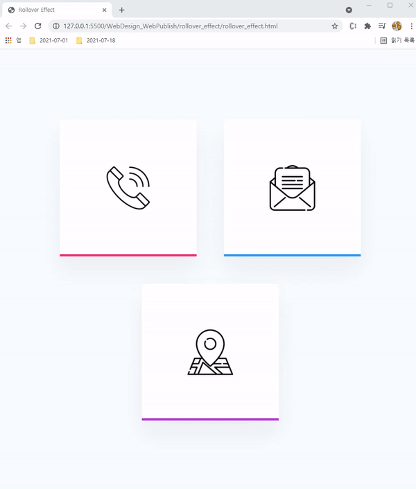
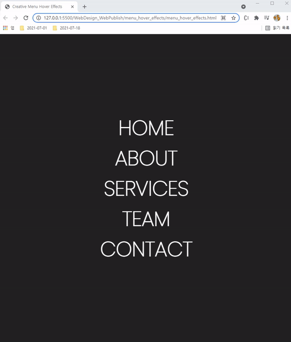
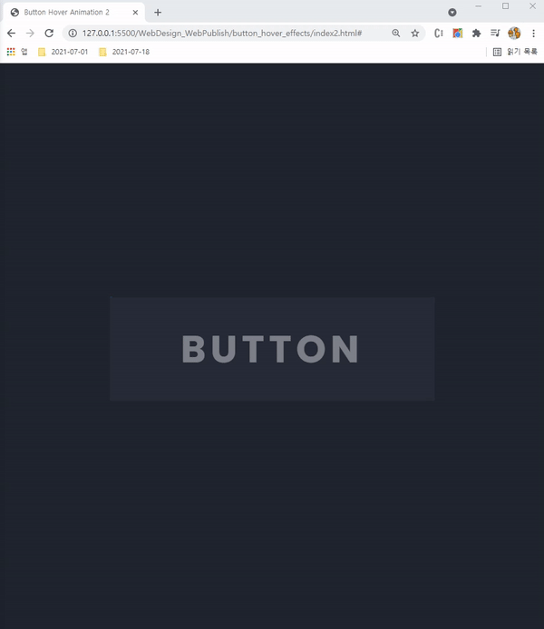
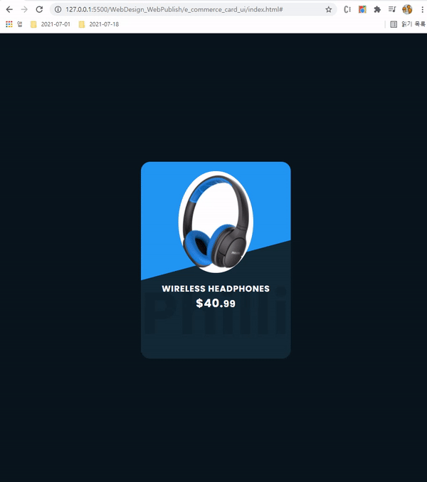

웹 디자인 분들의 자료, 생각을 공유하고 같이 공부하고자 하는 REPO

### rollover_effect 

- 참고 링크 : [링크](https://www.youtube.com/watch?time_continue=15&v=fs-kz0aCraE&feature=emb_logo)

### menu_hover_effects

- 참고 링크 : [링크](https://www.youtube.com/watch?v=TPh8fLeahqM)

### button_hover_effects 

- 2021.08.27 - 이전부터 조금 해둔 Youtube 과정 업로드 

    - 열심히 배우겠습니다

    - 현재 CSS 문법 정리 중 

### e_commerce_card

### split_video_background 

